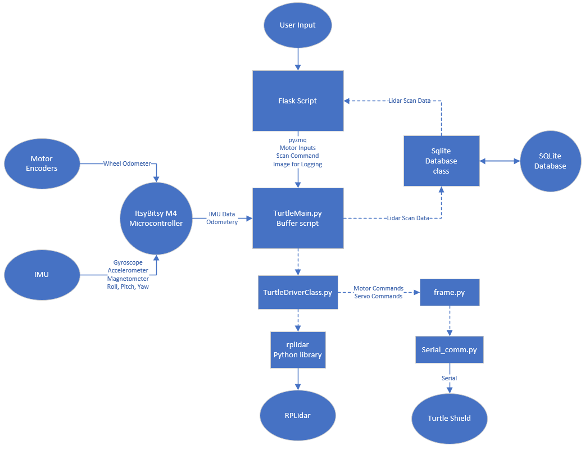

# Turtle Rover Lidar Pipe Scanner

Reuirements:
```sudo pip3 install --upgrade pip```

ONLY FOR WEBSERVER SO FAR:

```sudo pip3 install setuptools pretty_errors lsq-ellipse imutils numpy opencv-python-headless flask zmq```


<!---```sudo pip3 install csv pickle bz2 zipfile sqlite3``` --->

Repository for Turtle Rover pipe scanning robot with lidar gimbal
* [Webstreaming.py](webstreaming.py) is the main script to run the flask based web server where user inputs will come from and then be sent through pyzmq to a bufferscript.
* [TurtleMain.py](TurtleMain.py) is the main script where functions are called from. Commands for the robot come into this script from the flask web server through pyzmq publishers and subscribers.
* [TurtleDriverClass.py](TurtleDriverClass.py) is the main class where functions for the turtle rover and lidar gimbal are found. Functions include handling motor commands for moving the rover and, zeroing the lidar within the pipe, and scanning the pipe with the lidar. 
* [TurtleLidarDB.py](TurtleLidarDB.py) is the class that interfaces with the SQLite database for storing and accessing data
* [frame.py](frame.py) is a script containing functions from [turtle rover](https://github.com/TurtleRover/tr_ros/tree/master/tr_hat_bridge) that formats command messages to then send to the Turtle's shield.
* [serial_comm.py](serial_comm.py) is the script containing functions from [turtle rover](https://github.com/TurtleRover/tr_ros/tree/master/tr_hat_bridge) that sends commands to the Turtle's shield through serial communication. 
* [utils.py](utils.py) is the script containing functions from [turtle rover](https://github.com/TurtleRover/tr_ros/tree/master/tr_hat_bridge) containting misc static functions for [TurtleDriverClass](TurtleDriverClass.py) functions.

##### SQLite Databse:

id | timestamp | odometer| lidar | AvgR | stdR | minR | maxR | Xcenter | Ycenter | gyro | Image | batVolt | Deleted 
---|-----------|---------|-------|------|------|------|------|---------|---------|------|-------|---------|--------
unique number for row| time of scan | distance traveled| Lidar Data| Average Radius (adjusted to center of circle)| Standard Deviation of Radius (adjusted to center of circle) | Minimum Radius (adjusted to center of circle) | Maximum Radius (adjusted to center of circle) | X offset for circle center | Y offset for circle center | IMU Data | Image at time of scan | Battery Voltage | Boolean if row should be shown
n | Unix Time | meters | Binary | mm | mm | mm | mm | mm | mm | Binary | Binary | Volts | True/False

* Binary Data is serialized using pickle before inserting into database
* Lidar Data is compressed with bz2 and formatted: ((angle, distance), ..., ...)
* Gyro Data is formatted as a tuple: (euler, gyro, acc, mag)
* The image is formatted as a .png

##### Code Diagram:

